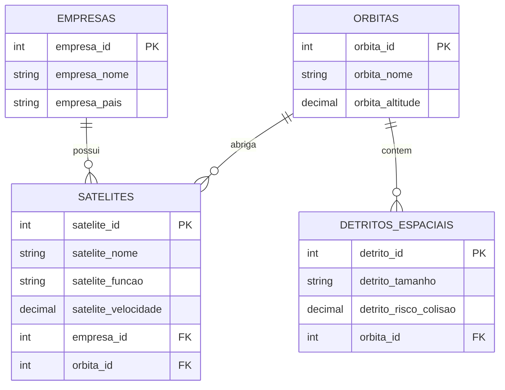

# SatGuard - API de Monitoramento Espacial (.NET) 🛰️🌍

Projeto desenvolvido para a **Global Solution 2026** da FIAP, focado no tema **Economia Espacial**. 

Esta é a ramificação do projeto construída em **.NET**, servindo como uma **API RESTful** para gerenciar o monitoramento espacial, prevenindo a poluição e protegendo ativos críticos no espaço.

## 🚀 Viabilidade, Inovação e Tecnologias

A inovação deste projeto baseia-se na proteção do ecossistema espacial (Economia Espacial). A solução utiliza:
- **.NET 10 (C#)** e **ASP.NET Core Web API** (Atualizado e compatível)
- **Entity Framework Core 8/9** (ORM)
- Persistência com Banco de Dados Relacional (**SQLite** configurado nativamente)
- **Migrations** ativadas para controle de versão do banco de dados

## 🏗️ Arquitetura e Boas Práticas (Desenvolvimento)

O projeto atende a estritas boas práticas de programação e arquitetura exigidas no mercado:
- **Padrão DTO (Data Transfer Objects):** A API não expõe diretamente os modelos do banco de dados. Todas as requisições passam por classes `[Model]RequestDTO` e `[Model]ResponseDTO` para garantir segurança e isolamento.
- **Camada de Serviços e Repositórios:** Implementamos o padrão `Repository` genérico e injetamos as regras de negócio nos `Services`, garantindo que os Controllers fiquem extremamente limpos.
- **Validações Rigorosas:** Os DTOs implementam validações complexas com *Data Annotations* (ex: `[Required]`, `[StringLength]`, `[Range]`) para rejeitar dados inválidos automaticamente (Erro 400).
- **CRUD Completo de Ponta a Ponta:** Os controladores (`SatelitesController`, `EmpresasController`, etc.) possuem `GET`, `GET por ID`, `POST`, `PUT` e `DELETE`.

## 📊 Diagrama do Banco de Dados



### Explicação do Diagrama (Para a Defesa)
O banco de dados foi modelado para refletir a realidade da economia espacial. O coração do sistema são as **Órbitas**, que abrigam tanto **Satélites** quanto **Detritos Espaciais** (Relacionamento 1:N). Ao mesmo tempo, cada **Satélite** é propriedade de uma **Empresa** (Relacionamento 1:N). Com essa modelagem relacional, nós conseguimos rastrear exatamente qual empresa tem satélites em rotas de colisão com detritos, permitindo a emissão de alertas. Se uma Órbita for deletada, o comportamento em cascata do EF Core pode ser configurado de acordo com a regra de negócio.

## ⚙️ Instruções de Acesso e Execução

Para rodar o projeto localmente e acessar a documentação interativa:

1. Clone o repositório:
   ```bash
   git clone https://github.com/C-A-V-Enterprise/space-sense.net.git
   ```
2. Entre na pasta da API:
   ```bash
   cd space-sense.net/SpaceSense.Api
   ```
3. A base SQLite (`satguard.db`) e a Migration inicial (`InitialCreate`) já estão integradas no repositório. Basta iniciar a aplicação:
   ```bash
   dotnet run
   ```

A API conta com a interface visual do **Swagger UI** integrada e configurada para redirecionamento automático!
- Assim que o `dotnet run` iniciar, acesse o link gerado no seu terminal no navegador (geralmente `http://localhost:5222`).
- Você será automaticamente redirecionado para `http://localhost:5222/swagger`.

## 🧪 Parte de Testes (Testes Automatizados e Manuais)

A arquitetura foi testada de ponta a ponta. 

**Testes Automatizados (xUnit e Moq):**
O projeto inclui a pasta `SpaceSense.Api.Tests` cobrindo a lógica.
Para rodar os testes:
```bash
cd ../SpaceSense.Api.Tests
dotnet test
```

### Exemplos de Testes Manuais via JSON (Payloads)

Use esses JSONs no **Swagger** para testar as rotas de criação (`POST`) e atualização (`PUT`):

**1. POST /api/Empresas** (Criar Empresa)
```json
{
  "empresaNome": "SpaceX",
  "empresaPais": "EUA"
}
```

**2. POST /api/Orbitas** (Criar Órbita)
```json
{
  "orbitaNome": "Órbita Terrestre Baixa (LEO)",
  "orbitaAltitudeBase": 2000.0,
  "orbitaTipo": "Circular"
}
```

**3. POST /api/Satelites** (Criar Satélite vinculado à Empresa e Órbita)
```json
{
  "sateliteNome": "Starlink-101",
  "sateliteFuncao": "Comunicação",
  "sateliteStatus": "A",
  "sateliteDataLancamento": "2026-05-30T10:00:00Z",
  "sateliteVelocidade": 7500.50,
  "empresaId": 1,
  "orbitaId": 1
}
```

*Experimente tentar enviar um POST sem preencher os campos obrigatórios ou enviar um JSON vazio `{}` para ver as validações de DTO do .NET em ação (Erro 400 Bad Request)!*

## 👥 Integrantes

- **Gabriel Garcia** - RM: [SEU_RM_AQUI] - [GitHub](https://github.com/gabriel-g-dev)
- [NOME DO INTEGRANTE 2] - RM: [RM AQUI]
- [NOME DO INTEGRANTE 3] - RM: [RM AQUI]
