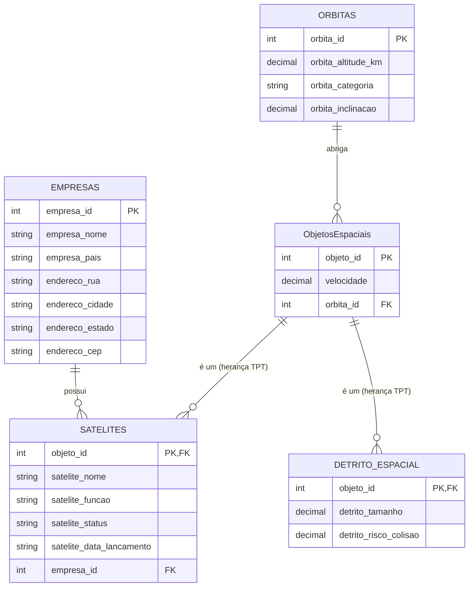

# SatGuard - API de Monitoramento Espacial (.NET) 🛰️🌍

Projeto desenvolvido para a **Global Solution 2026** da FIAP, focado no tema **Economia Espacial**. 

Esta é a ramificação do projeto construída em **.NET**, servindo como uma **API RESTful** para gerenciar o monitoramento espacial, prevenindo a poluição e protegendo ativos críticos no espaço.

## 🚀 Viabilidade, Inovação e Tecnologias

A inovação deste projeto baseia-se na proteção do ecossistema espacial (Economia Espacial). A solução utiliza:
- **.NET 10 (C#)** e **ASP.NET Core Web API** (Atualizado e compatível)
- **Entity Framework Core 8/9** (ORM)
- Persistência com Banco de Dados Relacional (**Oracle Database**)
- **Migrations** ativadas para controle de versão do banco de dados

- **Link do Vídeo de Demonstração (.NET):** [Assistir no YouTube](https://youtu.be/RIMhPQtCTOY)
- **Link do Vídeo de Apresentação (Pitch):** [Assistir no YouTube](https://youtu.be/WOXdy4cQ1gE)

## 🏗️ Arquitetura Sênior (Desenvolvimento Avançado)

O projeto atende a estritas boas práticas de programação e arquitetura exigidas no mercado, espelhando complexidades avançadas:
- **Padrão de Camadas (Clean Architecture):** Divisão lógica em Controllers, Services, Repositories e Models.
- **Segurança (JWT Bearer):** Autenticação robusta nas rotas de CRUD.
- **Herança no EF Core:** Utilização do padrão TPT (Table-Per-Type) com a classe base `ObjetoEspacial`.
- **Value Objects:** Uso de `[Owned]` types para separar o `Endereco` dentro de `Empresa`.
- **Injeção de Dependência:** O padrão `IRepository<T>` foi implementado para flexibilidade.
- **Configurações e Segurança:** Chaves sensíveis geridas no `appsettings.json` lidas via `IConfiguration`, além da configuração de política **CORS** habilitada.
- **DTOs:** Entrada e saída isoladas das entidades do banco.

## 📊 Diagrama do Banco de Dados



### Explicação do Diagrama (Para a Defesa)
O banco de dados foi modelado para refletir a realidade da economia espacial, utilizando o padrão **TPT (Table-Per-Type)** do Entity Framework Core. O coração do sistema são as **Órbitas**, que abrigam **Objetos Espaciais**. As tabelas `SATELITES` e `DETRITO_ESPACIAL` herdam propriedades da tabela `ObjetosEspaciais` (compartilhando o `objeto_id` e a `velocidade`). Além disso, os dados de endereço das empresas estão embutidos (Value Objects / `[Owned]`) diretamente na tabela `EMPRESAS`, economizando JOINs nas consultas. Se uma Órbita for deletada, o comportamento em cascata do EF Core exclui os objetos espaciais nela.

## ⚙️ Instruções de Acesso e Execução

Para rodar o projeto localmente e acessar a documentação interativa:

1. Clone o repositório:
   ```bash
   git clone https://github.com/C-A-V-Enterprise/space-sense.net.git
   ```
2. Entre na pasta da API:
   ```bash
   cd space-sense.net/SpaceSense.Api
   ```
3. Insira suas credenciais (RM e Senha) da FIAP no arquivo `appsettings.json`. Em seguida, aplique a Migration para criar as tabelas no seu banco Oracle rodando:
   ```bash
   dotnet ef database update
   ```
4. Inicie a aplicação:
   ```bash
   dotnet run
   ```

A API conta com a interface visual do **Swagger UI** integrada e configurada para redirecionamento automático!
### 1. Testando pelo Swagger
Para testar os endpoints restritos (POST, PUT, DELETE), você deve primeiro gerar o Token JWT:
1. Abra a rota `POST /api/Usuarios/login`.
2. Utilize o payload:
   ```json
   {
     "email": "admin@satguard.com",
     "senha": "123456"
   }
   ```
3. Copie o token retornado.
4. Vá até o topo do Swagger, clique em **Authorize** e insira o token na caixa. Pronto! Você está logado.
- Assim que o `dotnet run` iniciar, acesse o link gerado no seu terminal no navegador (geralmente `http://localhost:5222`).
- Você será automaticamente redirecionado para `http://localhost:5222/swagger`.

## 🧪 Parte de Testes (Testes Automatizados e Manuais)

A arquitetura foi testada de ponta a ponta. 

**Testes Automatizados (xUnit e Moq):**
O projeto inclui a pasta `SpaceSense.Api.Tests` cobrindo a lógica.
Para rodar os testes:
```bash
cd ../SpaceSense.Api.Tests
dotnet test
```

### Exemplos de Testes Manuais via JSON (Payloads)

Use esses JSONs no **Swagger** para testar as rotas de criação (`POST`) e atualização (`PUT`):

**1. POST /api/Empresas** (Criar Empresa)
```json
{
  "empresaNome": "SpaceX",
  "empresaPais": "EUA",
  "enderecoRua": "Rocket Road",
  "enderecoCidade": "Hawthorne",
  "enderecoEstado": "CA",
  "enderecoCep": "90250"
}
```

**2. POST /api/Orbitas** (Criar Órbita)
```json
{
  "orbitaNome": "Órbita Terrestre Baixa (LEO)",
  "orbitaAltitudeBase": 2000.0,
  "orbitaTipo": "Circular"
}
```

**3. POST /api/Satelites** (Criar Satélite vinculado à Empresa e Órbita)
```json
{
  "sateliteNome": "Starlink-101",
  "sateliteFuncao": "Comunicação",
  "sateliteStatus": "A",
  "sateliteDataLancamento": "2026-05-30T10:00:00Z",
  "sateliteVelocidade": 7500.50,
  "empresaId": 1,
  "orbitaId": 1
}
```

*Experimente tentar enviar um POST sem preencher os campos obrigatórios ou enviar um JSON vazio `{}` para ver as validações de DTO do .NET em ação (Erro 400 Bad Request)!*

## 👥 Integrantes

- **André Bellandi Vital Rodrigues** - RM: 564662
- **Vitor Augusto Oliveira de Abreu** - RM: 564227
- **Gabriel Garcia Mayo Delatore** - RM: 563298
